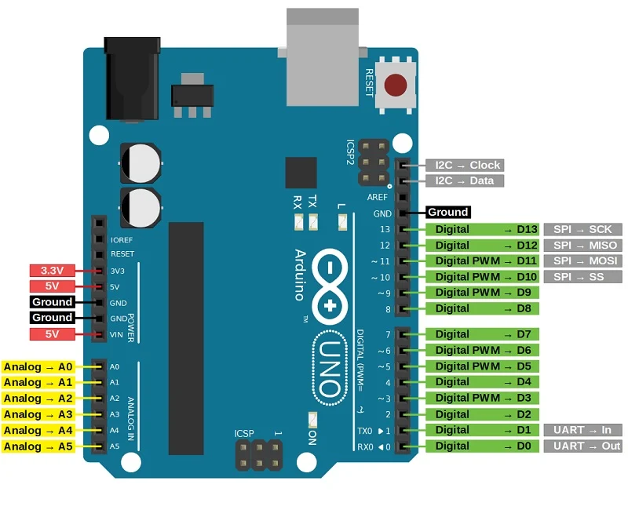

# Arduino

**Vin:** This is the input voltage pin of the Arduino board used to provide input supply from an external power source.

**5V:** This pin of the Arduino board is used as a regulated power supply voltage and it is used to give supply to the board as well as onboard components.

**3.3V:** This pin of the board is used to provide a supply of 3.3V which is generated from a voltage regulator on the board

**GND:** This pin of the board is used to ground the Arduino board.

**Reset:** This pin of the board is used to reset the microcontroller  It is used to Resets the microcontroller.

**Analog Pins:** The pins A0 to A15 are used as an analog input and it is in the range of 0-5V. The analog pins on this board can be used as a  digital Input or Output pins.

**Serial pins:** It is used for communication between the Arduino board and a computer or other devices. 

The TXD and RXD are used to transmit & receive the serial data resp. It includes serial 0, Serial 1, serial 2, **Serial 3 as follows:**
1. **Serial 0:** It consists of Transmitter pin number 1 and receiver pin number 0
2. **Serial 1:**  It consists of Transmitter pin number 18 and receiver pin number 19
3. **serial 2:** It consists of Transmitter pin number 16 and receiver pin number 17
4. **Serial 3:** It consists of Transmitter pin number 14 and receiver pin number 15

**External Interrupts pins:** This pin of the Arduino board is used to produce the External interrupt and it is done by the pin numbers 0,3,21,20,19,18.

**I2C:**  This pin of the board is used for I2C communication. 

Pin number 20 signifies Serial Data Line (SDA)and it is used for holding the data.
Pin number 21 signifies Serial Clock Line (SCL) and it is used for offering data synchronization among the devices.
**SPI Pins:** This is the Serial Peripheral Interface pin, it is used to maintainSPI communication with the help of **the SPI library. SPI pins include:**

1. **MISO:** Pin number 50 is used as a Master In Slave Out
2. **MOSI:** Pin number 51 is used as a Master Out Slave In
3. **SCK:** Pin number 52 is used as a Serial Clock
4. **SS:** Pin number 53 is used as a Slave Select

**LED Pin:**  The board has an inbuilt LED using digital pin-13. The LED glows only when the digital pin becomes high.

**AREF Pin:** This is an analog reference pin of the Arduino board. It is used to provide a reference voltage from an external power supply.

**Rerefensi:**
- [Arduino Pin Configuration](https:**//robu.in/arduino-pin-configuration/)
