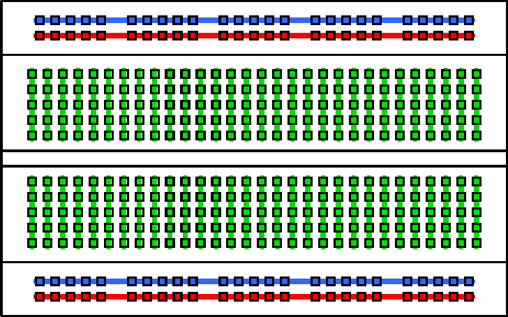

# Breadboard

Penjelasan cara kerja breadboard sebagai berikut:
- Jalur titik tancap breadboard ***merah*** dan ***biru*** memanjang secara horizontal
- Jalur titik tancap breadboard ***merah*** umumnya dipakai untuk jalur tegangan DC + (plus)
- Jalur titik tancap breadboard ***biru*** umumnya dipakai untuk jalur tegangan DC - (minus)
- Jalur titik tancap breadboard ***hijau*** dipakai untuk pemasangan komponen seperti resistor,dioda,lampu led dan lain-lain

---
sumber
- https://www.rsetiawan.com/2022/04/breadboard.html
