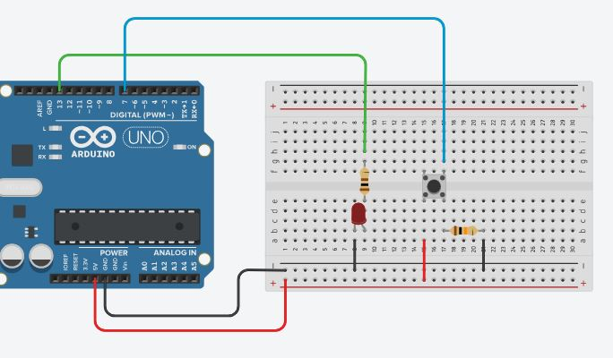
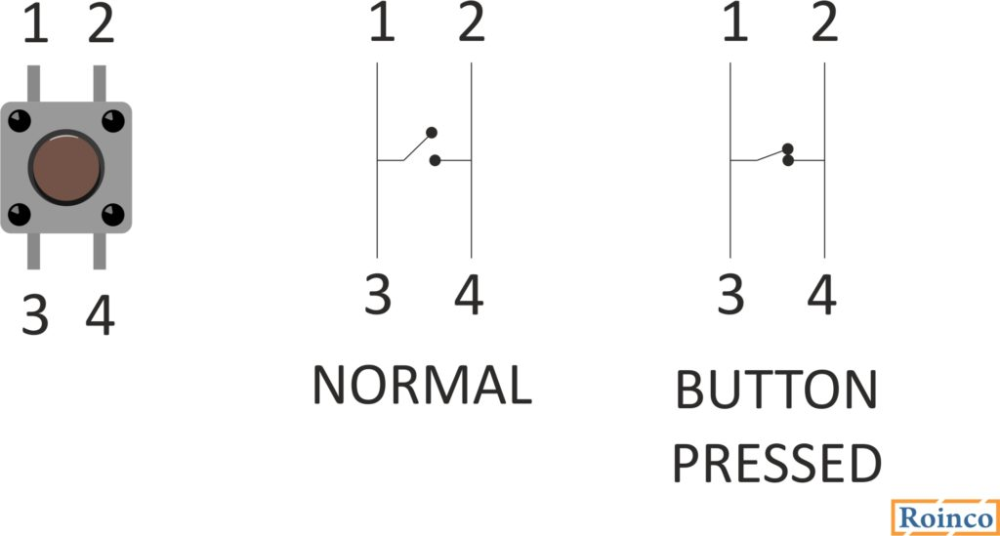

# Button

Button adalah salah alat input yang paling sederhana yang kita bisa coba. Perhatikan rangkaian berikut:



```cpp
int pinLED = 13; // NodeMCU: D0
int pinButton = 7; // NodeMCU: D1

int status=0;

void setup()
{
  pinMode(pinLED, OUTPUT);
  pinMode(pinButton,INPUT);
  Serial.begin(9600);
}

void loop()
{
  status = digitalRead(pinButton);

  Serial.println(status); // menampilkan nilai yang dibaca digitalRead()

  if(status==HIGH) {
    digitalWrite(pinLED, HIGH);
  } else {    
    digitalWrite(pinLED, LOW);
  }
}
```

Untuk membaca kondisi tombol, digunakan `digitalRead()`. Fungsi ini akan mengembalikan nilai `HIGH` pada saat tombol ditekan, `LOW` pada saat dilepas.

Dalam membuat rangkaian sirkuit menggunakan button, perhatikan skema berikut:

