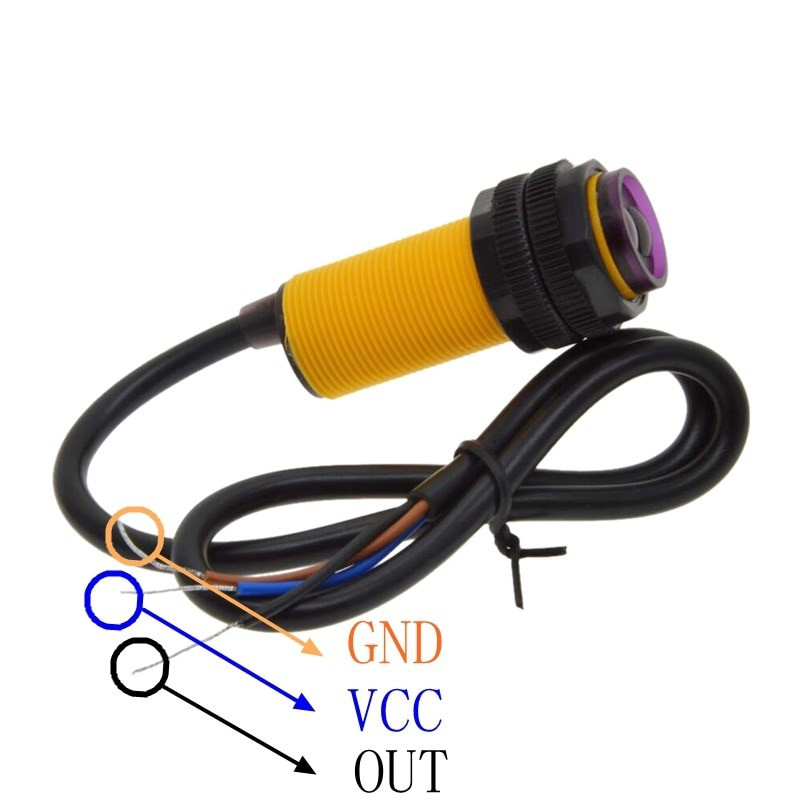
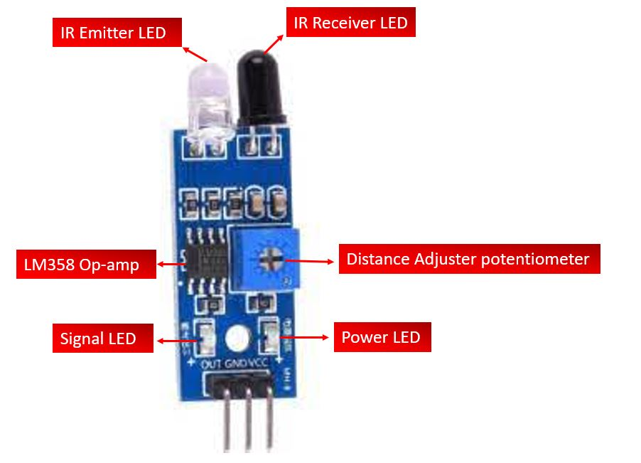
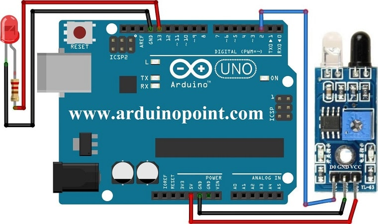

# Infrared Proximity Sensor

Infrared Proximity Sensor (IR Proximity) adalah sensor yang menggunakan _infrared_ untuk mendeteksi halangan benda di depannya.

Berbeda dengan [ultrasonic sensor](komponen-ultrasound.md), _IR Proximity_ tidak bisa mendeteksi jarak, ia hanya mendeteksi ada tidaknya halangan di depannya.

## Diagram





## Contoh penggunaan



```cpp
int LED = 13;
int irPin = 2; //ESP32:5
int adabenda;

void setup() {
  pinMode(LED, OUTPUT);
  pinMode(irPin, INPUT);
}

void loop() {
  // hasil pembacaan digitalRead(irPin) akan menghasilkan LOW jika sensor mendeteksi benda
  adabenda = digitalRead(irPin);
  
  if (adabenda == LOW)   {
    digitalWrite(LED, HIGH);
  } else {
    digitalWrite(LED, LOW);
  }
  delay(200);
}
```
