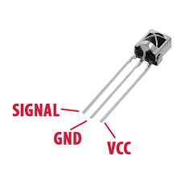

# Infrared Receiver

_Infrared Receiver_ adalah komponen yang digunakan untuk menangkap sinyal dari _infrared transmiter_.



Untuk mempermudah kita membaca data dari _infrared receiver_, kita memanfaatkan header _IRremote.h_. Install header ini lewat menu _Tools - Manage Libraries_ (cari "IRremote.h")

Untuk mencobanya, buatlah rangkaian sederhana microcontroller + _infrared receiver_ dengan program sebagai berikut:

```cpp
#include <IRremote.h>

void setup() {
  Serial.begin(9600);
  IrReceiver.begin(8); //8: nomor PIN untuk sinyal dari IR Receiver
}
void loop() {
  if (IrReceiver.decode()) {
    if(IrReceiver.decodedIRData.command>0) { // jika ada sinyal, tampilkan data
        Serial.println("================");
        
        // menampilkan data integer
        Serial.println(IrReceiver.decodedIRData.command);
        IrReceiver.resume();

        delay(1000);      
    }
    
  }
}
```

Upload dan lihat hasilnya pada Arduino. Untuk mencobanya, gunakan sembarang remote yang menggunakan infrared, arahkan pada _infrared receiver_ kemudian lihat hasilnya pada _Serial Monitor_ ketika Anda menekan tombol pada remote control.


## _Infrared Receiver_ pada ESP8266/NodeMCU

Penggunaan _infrared receiver_ di ESP8266/NodeMCU memerlukan header yang berbeda, yaitu _IRremoteESP8266.h_. Anda bisa menginstallnya lewat _Tools - Manage Libraries_. Sebagai catatan, pin _signal_ dari _infrared receiver_ tidak bisa menggunakan pin 16 (D0), tapi Anda bisa menggunakan pin 5 (D1). Berikut contoh programnya:

```cpp
#include <Arduino.h>
#include <IRremoteESP8266.h>
#include <IRrecv.h>
#include <IRutils.h>

// An IR detector/demodulator is connected to GPIO pin 5 (D1 on a NodeMCU
// board).
// Note: GPIO 16 won't work on the ESP8266 as it does not have interrupts.
const uint16_t kRecvPin = 5;
unsigned long key_value = 0;

IRrecv irrecv(kRecvPin);

decode_results results;

void setup() {
  Serial.begin(9600);
  irrecv.enableIRIn();  // Start the receiver
}

void loop() {
  if (irrecv.decode(&results)) {
    // print() & println() can't handle printing long longs. (uint64_t)
    serialPrintUint64(results.value);
    irrecv.resume();  // Receive the next value
  }
  delay(100);
}
```