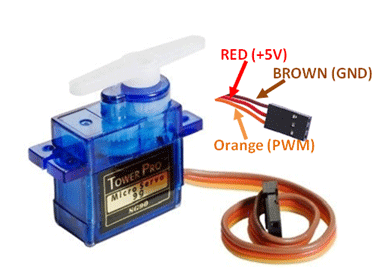
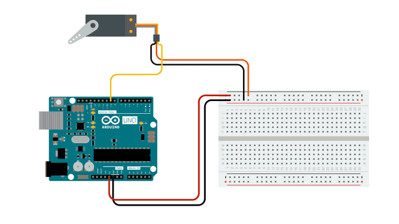

# Servo

Motor Servo adalah jenis Aktuator elektromekanis yang tidak berputar secara kontinu seperti motor DC atau motor stepper. Motor servo digunakan untuk posisi dan memegang beberapa objek. Motor jenis ini digunakan dimana rotasi kontinu tidak diperlukan sehingga tidak digunakan untuk mengendalikan roda (kecuali servo ini dimodifikasi). Sebaliknya, motor servo digunakan dimana sesuatu yang dibutuhkan pindah ke posisi tertentu dan kemudian berhenti dan bertahan pada posisi itu.



## Contoh penggunaan:



```cpp
#include <Servo.h>

Servo myservo;  // buat objek servo

void setup() {
  // set nomor pin yang digunakan
  // - arduino: 9
  // - esp32: 13
  // - esp8266: 2 (D4)
  myservo.attach(9); 
}

void loop() {
  myservo.write(180);   // instruksikan servo untuk bergerak ke posisi 180
  delay(3000);          // tunggu 3 detik untuk servo bergerak ke posisi yang ditentukan
  myservo.write(0);     // instruksikan servo untuk bergerak ke posisi 0
  delay(3000);            // tunggu 3 detik untuk servo bergerak ke posisi yang ditentukan
}
```