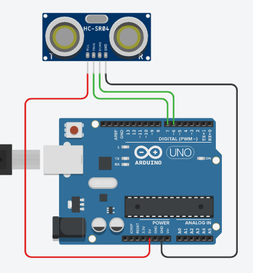

# Komponen: Ultrasound (HC-SR04)

Komponen Ultrasound adalah sensor untuk mendeteksi jarak benda yang ada dihadapannya. Komponen ini menggunakan suara untuk melakukan deteksi. Ultrasound bisa melakukan deteksi benda dengan jarak efektif 2-400cm.


Rangkaian sederhana menggunaan komponen ultrasound:



```cpp
double cm;

int pinTrigger = 7;  // NodeMCU: D8
int pinEcho = 6;     // NOdeMCU: D7

// function untuk membaca jarak
double bacaJarak()
{
    // pastikan ultrasound dalam keadaan mati
    digitalWrite(pinTrigger, LOW);
    delayMicroseconds(2);
    
    // kirim sinyal suara
    // 10 Microsecond adalah standard durasi pengiriman standard untuk melakukan pengukuran menggunakan ultrasound
    digitalWrite(pinTrigger,HIGH);
    delayMicroseconds(10);
    // matikan
    digitalWrite(pinTrigger,LOW);
    
    // baca pulsa suara
    long pulse=pulseIn(pinEcho,HIGH);
    
    return pulse/58; // rumus konversi hasil pembacaan sensor (pulse) ke sentimeter  
}

void setup()
{
  pinMode(pinTrigger,OUTPUT);
  pinMode(pinEcho,INPUT);
  Serial.begin(9600);
}

void loop()
{
    // membaca jarak dari sensor ultrasound
    cm = bacaJarak();

    // hasil pembacaan jarak ditampilkan di Serial Monitor
    Serial.print("Jarak = ");
    Serial.println(cm);

    delay(100);
}
```

💡 _Tinkercad Tips_:\
Pada saat simulasi, klik pada komponen ultrasound. Anda bisa mensimulasikan deteksi benda dengan menggeser tanda 🟢. Anda juga bisa membandingkan jarak benda yang disimulasikan dengan nilai yang dibaca oleh sensor di _Serial Monitor_.


📚 Referensi Belajar:
- https://lastminuteengineers.com/arduino-sr04-ultrasonic-sensor-tutorial/