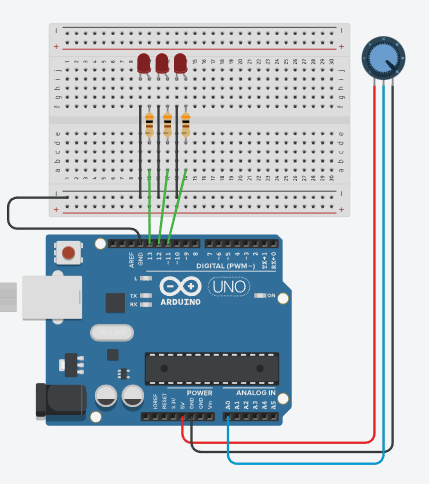

# Latihan 01

## Soal 1


Perbaiki program ini sehingga bisa _running_.

```cpp
int led1 = 13;
int led2 = 12;
int led3 = 11

void setup() {
  pinMOde(input, INPUT);
  pinMode(led1, OUTPUT);
  pinMode(led2, OUTPUT);
  pinMode(led3, OUTPUT);
}

void loop() {
  int x = analogRead();
  
  if(x>600) 
    digitalWrite(led1,LOW);
    digitalWrite(led2,LOW);
    digitalWrite(led3,LOW);  
  else {
    digitalWrite(led1,HIGH);
    digitalWrite(led2,HIGH);
    digitalWrite(led3,HIGH);  
  }
}
```

## Soal 2


Perbaiki program ini sehingga bisa _running_.

```cpp

int trig = 7;
int echo = 6;

// function untuk membaca jarak
double jarakCm() {
  digitalWrite(trig, LOW);
  delayMicroseconds(2);
  
  digitalWrite(trig,HIGH);
  delayMicroseconds(10);
  digitalWrite(trig,LOW);
  
  long pulse=pulseIn(echo,HIGH);
  
  return pulse/58; // rumus konversi nilai pulse ke sentimeter
  


void setup
{
  pinMode(trig,OUTPUT);
  pinMode(echo,INPUT);
  Serial.begin(9600);
}

void loop()
{
   cm = jarakC();
   inch = cm x 0,393701
   Serial.print("Jarak CM  = );
   Serial.println(inch);
   Serial.print("Jarak INCH = );
   Serial.println(inch)

}


```

## Soal 3

Lengkapi program pada **Soal 2** sehingga menjalan program sebagai berikut:
1. Jika jarak 0-30cm, bunyikan suara 2000Hz
2. Jika jarak 30-100cm, bunyikan suara 1000Hz
3. Jika jarak >100cm, tidak ada suara dan tampilkan tulisan di _Serial Monitor_: "tidak ada benda"

## Soal 4
Pelajari rangkaian dan program dibawah ini, kemudian ceritakan cara kerjanya:


```cpp
int pinIr = 2;
int led = 13;
int adabenda;
int x;
int count = 0;
 
void setup () {
    pinMode (pinIr, INPUT);
    pinMode (led, OUTPUT); 
    Serial.begin(9600);
}
 
void loop() {
    int adabenda = digitalRead(pinIr);

    if (adabenda == HIGH){
        x = 1;
        digitalWrite(led, LOW);
    } 

    if ((adabenda==LOW)&&(x==1)) {
        x = 0;
        digitalWrite(led, HIGH);
        count = count + 1;
        Serial.println(count);
    }
    
}
```

## Soal 5
Terapkan metode "counter" seperti pada _Soal 4_ pada rangkaian pada _Soal 2_.