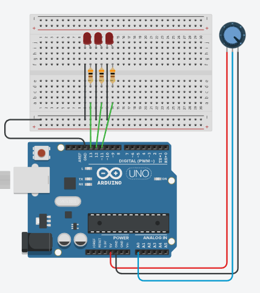
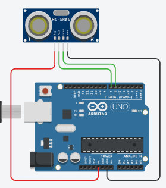
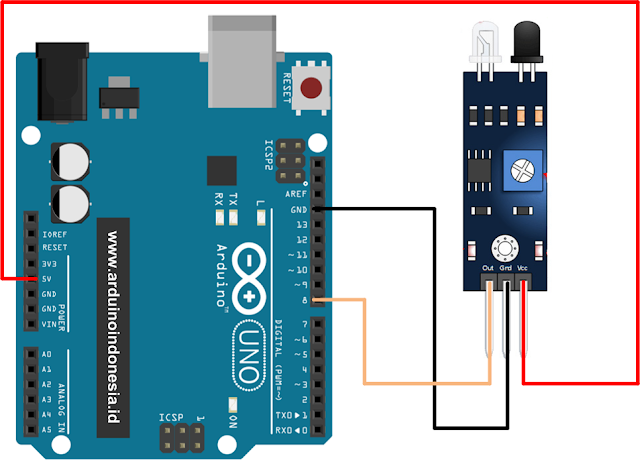

# Latihan 02

## Soal 1


Program dibawah ini mengadung 5 kesalahan. Perbaiki program ini sehingga bisa _running_.

```cpp
int pinLed1 = 13;
int pinLed2 = 12;
int pinLed3 = 11

void setup() {
  pinMOde(pinInput, INPUT);
  pinMode(pinLed1, OUTPUT);
  pinMode(pinLed2, OUTPUT);
  pinMode(pinLed3, OUTPUT);
}

void loop() {
  int x = analogRead(0);
  Serial.println(x);
  
  if(x>500) {
    digitalWrite(pinLed1,HIGH);
    digitalWrite(pinLed2,LOW);
    digitalWrite(pinLed3,LOW);  
}
```

## Soal 2



Program dibawah ini mengadung 5 kesalahan. Perbaiki program ini sehingga bisa _running_.

```cpp

int pinTrigger = 7;
int pinEcho = 6;

// function untuk membaca jarak
double bacaJarak()
{
  digitalWrite(pinTrigger, LOW);
  delayMicroseconds(2);
  
  digitalWrite(pinTrigger,HIGH);
  delayMicroseconds(10);
  digitalWrite(pinTrigger,LOW);
  
  long pulse=pulseIn(pinEcho,HIGH);
  
  return pulse/58; // rumus konversi nilai pulse ke sentimeter
  
}

void setup
{
  pinMode(pinTrigger,OUTPUT);
  pinMode(pinEcho,INPUT);
  Serial.begin(9600);
}

void loop()
{
   cm = bacaJarak;
   Serial.print("Jarak = );
   Serial.println(cm)

   delay(100);
}


```

## Soal 3

Lengkapi program pada **Soal 2** sehingga menjalan program sebagai berikut:
1. Jika jarak 0-30cm, tampilkan tulisan ke _Serial Monitor_: "terlalu dekat"
2. Jika jarak 30-100cm, tampilkan tulisan ke _Serial Monitor_: "dekat"
3. Jika jarak >100cm, tampilkan tulisan ke _Serial Monitor_: "jauh"

## Soal 4
Pelajari rangkaian dan program dibawah ini, kemudian ceritakan cara kerjanya:



```cpp
int pinIr = 2;
int led = 13;
int adabenda;
int x;
int count = 0;
 
void setup () {
    pinMode (pinIr, INPUT);
    pinMode (led, OUTPUT); 
    Serial.begin(9600);
}
 
void loop() {
    int adabenda = digitalRead(pinIr);

    if (adabenda == LOW){
        x = 1;
        digitalWrite(led, HIGH);
    } 

    if ((adabenda==HIGH)&&(x==1)) {
        x = 0;
        digitalWrite(led, LOW);
        count = count + 1;
        Serial.println(count);
    }
    
}
```