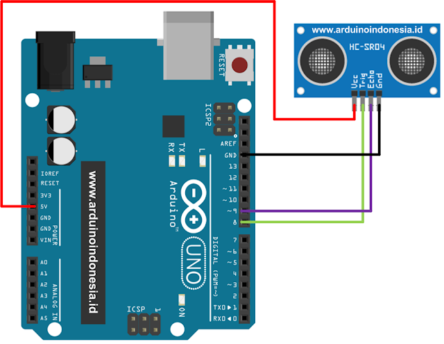

# Latihan 03



```cpp

int ________ = 9;  // A
int ________ = 8;  // B

double bacaJarak() {
    digitalWrite(pinTrigger, LOW);
    delayMicroseconds(2);
    
    digitalWrite(pinTrigger,HIGH);
    delayMicroseconds(10);

    digitalWrite(pinTrigger,LOW);
    
    long pulse=pulseIn(pinEcho,HIGH);
    
    return pulse/58; 
}

void ______()  // C
{
  pinMode(pinTrigger,OUTPUT);
  pinMode(pinEcho,INPUT);
  Serial.begin(9600);
}

void loop()
{
    cm = ______(); // D

    if( ______ ) { // E
        Serial.println("A");
    } else {
        Serial.println("B");
    }
    delay(100);
}


```