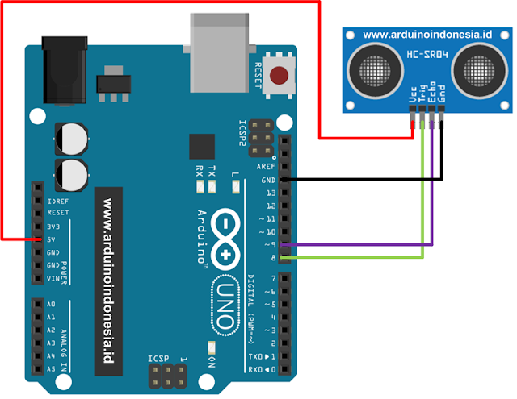

# Latihan 04



```cpp

int ________ = 8;  // A
int ________ = 9;  // B
double cm;

double ________() {  // C
    digitalWrite(pinTrigger, LOW);
    delayMicroseconds(2);
    
    digitalWrite(pinTrigger,HIGH);
    delayMicroseconds(10);

    digitalWrite(pinTrigger,LOW);
    
    long pulse=pulseIn(pinEcho,HIGH);
    
    return pulse/58; 
}

void setup() 
{
  pinMode(pinTrigger,_______ );  //D
  pinMode(pinEcho,_______); // E
  Serial.begin(9600);
}

void loop()
{
    cm = readCm(); 

    if( ______ ) { // F
        Serial.println("dekat");
    }

    delay(100);
}


```