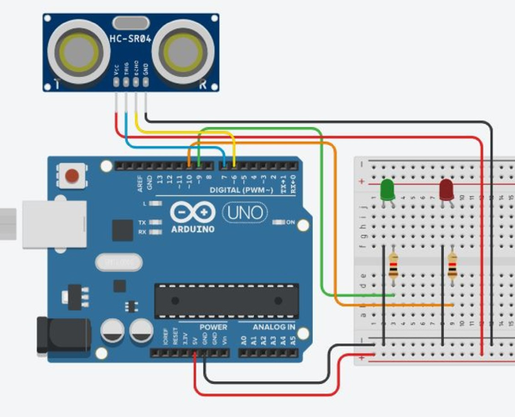

# Latihan 05



```cpp

int pinTrigger = __ ;  // A
int pinEcho = __ ;  // B

double bacaJarak() {  
    digitalWrite(pinTrigger, LOW);
    delayMicroseconds(2);
    
    digitalWrite(pinTrigger,HIGH);
    delayMicroseconds(10);

    digitalWrite(pinTrigger,LOW);
    
    long pulse=pulseIn(pinEcho,HIGH);
    
    return pulse/58; 
}

void setup() 
{
  pinMode(pinTrigger,_______ );  //C
  pinMode(pinEcho,_______); // D
  Serial.begin(9600);
}

void loop()
{
    cm = bacaJarak(); 

    if( cm < 100 ) { 
        digitalWrite(9, HIGH);
        digitalWrite(10,LOW);
    }
    if( cm < 200 ) { 
        digitalWrite(9, LOW);
        digitalWrite(10, HIGH);
    }
    if( cm >= 200) {
        digitalWrite(9, LOW);
        digitalWrite(10,LOW);
    }

    delay(100);
}
```