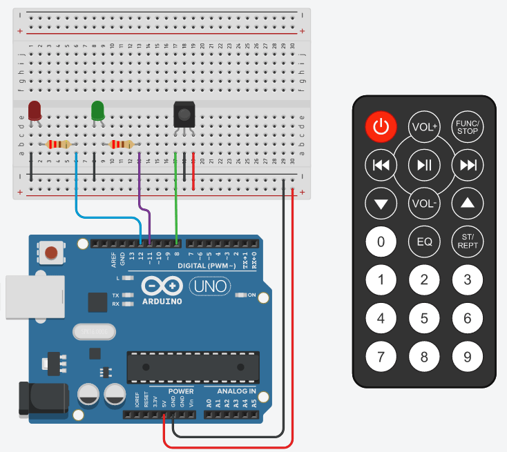

# Latihan 06



```cpp
#include <______> // A

int green = __; // B
int red = __; // C

void setup() {
  pinMode(green, ____ ); //D
  pinMode(red, ____ );  // E
  IrReceiver.begin(__);  // F
}
void loop() {
  if (IrReceiver.decode()) {
    if(IrReceiver.decodedIRData.command>0) { 
        
        if(______) { // G
            digitalWrite(green,HIGH);
            digitalWrite(red,LOW);
        }
        if(______) { // H
            digitalWrite(green,LOW);
            digitalWrite(red,HIGH);
        }
        IrReceiver.resume();

    }
    
  }
}
```