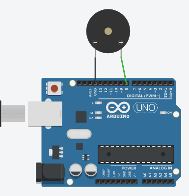

# Piezo

Buatlah rangkaian berikut:



Tambahkan kode berikut dan coba pelajari:

```cpp
// frekuensi awal
int frek = 100;

// penambahan frekuensi
int x = 10;

// pin output piezo
int pinPiezo = 8;

void setup() {
    pinMode(pinPiezo,OUTPUT);
    Serial.begin(9600);
}

void loop() {
  	
    tone(pinPiezo,frek);
    Serial.println(frek); // membantu programer mengencek frekuensi yang sedang aktif
    frek = frek + x;
  
    delay(100);
  
    // setiap frekuensi melewati angka 500 & 100, maka
    // x dikali -1. Sehingga ia akan berubah dari + jadi -
    // begitu juga sebaliknya
    // x positif berarti ini bagian dimana "nada naik"
    // x negatif berarti ini bagian dimana "nada turun"
    if(frek>500 || frek<100) {
      x*=-1; // naikan/turunkan frekuensi untuk loop berikutnya
    } 
    
         
}
```

Dari contoh diatas, coba kerjakan soal-soal berikut:

## Soal 1
Tambahkan _potentiometer_ ke dalam rangkaian. Ketika _potentiometer_ di putar, maka frekuensi yang dibunyikan berubah. Semakin diputar ke kanan, maka frekuensi akan semakin tinggi.

## Catatan
- Suara yang bisa didengar manusia adalah 20Hz-20KHz.
- Perangkat beberapa perangkat piezo memiliki jangkauan frekuensi yang berbeda
- Check juga referensi penggunaan [komponen potentiometer](../komponen-potensiometer.md)
