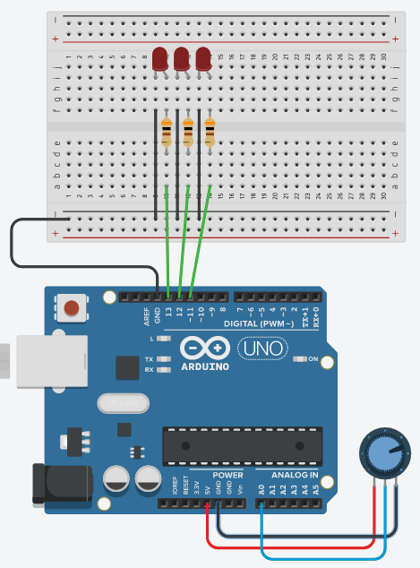

# Potensiometer + 3 LED

Buatlah rangkaian berikut:

## Soal 1:
Lengkapi skema diatas dengan program sehingga ketika potentiometer diputar full ke kanan maka ketiga LED menyala.

## Referensi:
- [Komponen: Potensiometer](../komponen-potensiometer.md)

