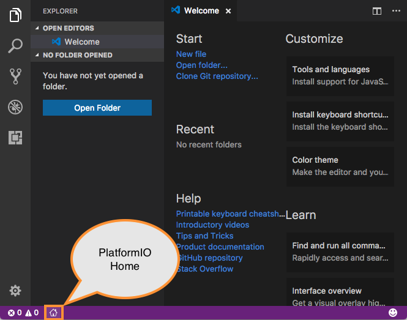
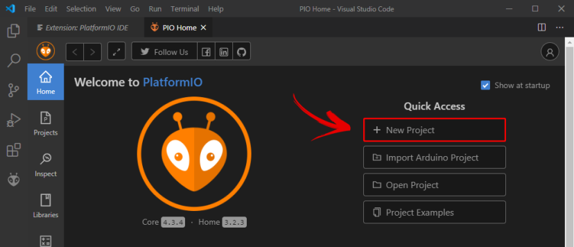
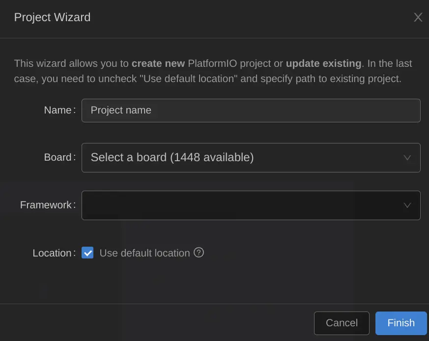

# Membuat Project Baru di PlatformIO

Setelah Anda selesai menginstall [ekstension PlatformIO](platformio.md), ikuti langkah berikut:

📚 Untuk board, pilih _NodeMCU 1.0 (ESP-12E Module)_ (atau sesuai dengan microcontroller yang Anda gunakan)