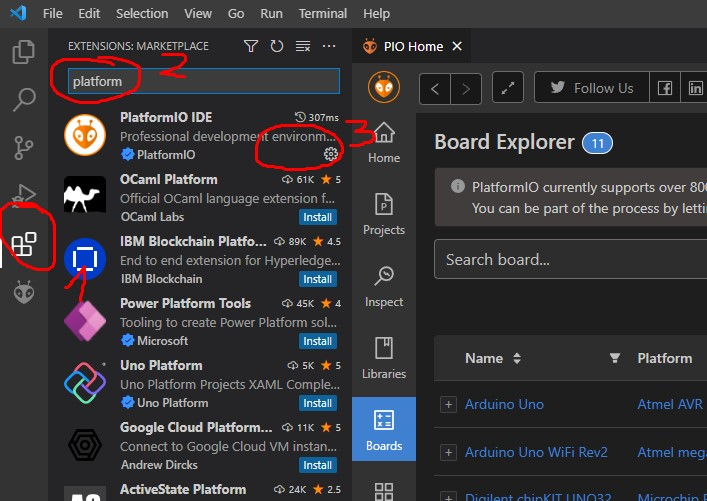

# PlatformIO

Ada bebeberapa alternatif program yang digunakan untuk mengembangkan program di microcontroller, tapi kali ini kita akan menggunakan _VS Code + PlatformIO extension_.

## Download & Install Extension

---
**Referensi:**
- [Setup PlatformIO di VS Code](https://www.anakteknik.co.id/traper/articles/kenalin-platform-io-ide-modern-untuk-embedded-device)