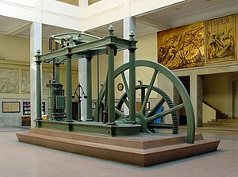
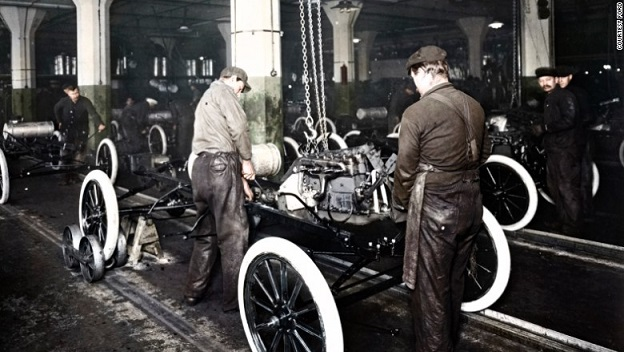

Revolusi industri adalah perubahan besar dan radikal terhadap cara manusia memproduksi barang. Bila tadinya ada beberapa hal yang semula begitu sulit, lama, mahal, maka dengan adanya revolusi industri beberapa hal menjadi mudah, cepat, dan murah.

Perubahan besar ini tercatat sudah terjadi tiga kali dan saat ini kita sedang mengalami revolusi industri yang keempat.

Setiap perubahan besar ini selalu diikuti oleh perubahan besar dalam bidang ekonomi, politik, bahkan militer dan budaya. Maka tak heran bila kini ada pekerjaan lama yang menghilang, dan jutaan pekerjaan baru yang muncul.

Revolusi industri menghasilkan penurunan, malah terkadang menghilangkan beberapa kelangkaan tersebut, sehingga waktu, tenaga, dan uang yang semula digunakan untuk mengatasi kelangkaan-kelangkaan tersebut mendadak bebas.

Hilangnya atau berkurangnya sebuah kelangkaan otomatis pada akhirnya mengubah banyak aspek dalam kehidupan bermasyarakat. Oleh karena itu, mari kita ulik sejarah revolusi industri dari 1.0, 2.0, 3.0 hingga 4.0.

# Revolusi Industri 1.0
Revolusi industri muncul pertama kali di negara Inggris pada akhir 1770-an dan menyebar ke negara-negara Eropa lainnya, seperti Belgia, Prancis, dan Jerman. Tak hanya Benua Eropa, revolusi ini turut menyebar di Amerika Serikat, pada tahun 1830-an dan 40-an.

Revolusi Industri 1.0 terjadi karena adanya tiga faktor utama, yakni Revolusi Pertanian, peningkatan populasi, dan keunggulan Inggris Raya.

Revolusi Industri menganggap era waktu yang penting karena teknik pertanian yang lebih baik, pertumbuhan populasi, dan keunggulan Inggris Raya yang memengaruhi negara-negara di seluruh dunia.

Revolusi industri 1.0 (pertama) adalah yang paling sering dibicarakan, yaitu proses yang dimulai dengan ditemukannya lalu digunakannya mesin uap dalam proses produksi barang. Penemuan mesin uap menjadi hal yang sangat penting kala itu, lantaran manusia sebelumnya hanya mengandalkan tenaga otot, tenaga air, dan tenaga angin untuk menggerakkan apa pun.

Bayangkan, tenaga otot amat terbatas. Butuh istirahat secara berkala untuk memulihkan tenaga tersebut, sehingga proses produksi menjadi terhambat. Dengan adanya mesin uap, semuanya menjadi lebih efektif.

Selain dengan otot, tenaga lain yang sering digunakan adalah tenaga air dan tenaga angin. Biasanya ini digunakan di penggilingan.

Untuk memutar penggilingan yang begitu berat, sering kali manusia menggunakan kincir air atau kincir angin. Masalahnya, manusia tak bisa menggunakannya di mana saja. Keduanya hanya bisa digunakan di dekat air terjun dan di daerah yang berangin. Tak hanya itu saja, tenaga angin juga tak bisa diandalkan 24 jam sehari. Ada kalanya benar-benar tak ada angin yang bisa digunakan untuk memutar kincir.

Hal ini kian diperparah ketika tenaga angin menjadi andalan transportasi internasional, yaitu transportasi laut. Misalnya saja di era VOC, untuk berlayar bolak-balik Batavia-Amsterdam-Batavia, dibutuhkan waktu setahun. Alasannya, terkadang ada kalanya benar-benar tak ada angin di laut, terkadang ada angin tetapi berlawanan dengan arah yang diinginkan.

Oleh karena itu, penemuan mesin uap mengubah segalanya. Terlebih lagi ketika James Watt di tahun 1776 menemukan mesin uap yang jauh lebih efisien dan murah dibandingkan mesin uap sebelumnya.

Dengan adanya mesin uap rancangan James Watt ini, sebuah penggilingan bisa didirikan di mana saja, tak perlu dekat air terjun atau daerah berangin. Selain itu, sebuah kapal bahkan bisa berlayar 24 jam, selama mesin uapnya dipasok dengan kayu atau batu bara. Hal Ini pada akhirnya berdampak langsung dalam waktu perjalanan dari Belanda ke Indonesia yang hanya berdurasi sekitar dua bulan.

Dampak lainnya dari perjalanan yang lebih singkat ini, bangsa Eropa pun mengirim kapal perang mereka ke seluruh penjuru dunia dalam waktu jauh lebih singkat. Tidak ada lagi cerita tentara-tentara Eropa kelelahan saat menyerang benteng milik Kerajaan Asia. Semua daerah yang bisa terjangkau oleh kapal laut, sudah pasti terjangkau oleh kekuatan imperialis Eropa. Negara-negara Imperialis di Eropa ini menjajah kerajaan-kerajaan di Afrika dan Asia. Ingat, di akhir 1800an inilah Belanda akhirnya menaklukkan daerah-daerah terakhir di Indonesia, seperti Aceh dan Bali.

Ketika tenaga mesin tidak dibatasi oleh otot, angin, dan air terjun, maka terjadilah penghematan biaya dalam jumlah luar biasa di bidang produksi, transportasi, bahkan militer.

Barang-barang yang diproduksi menjadi jauh lebih banyak, lebih murah, dan lebih mudah didapat. Uang yang semula dipakai untuk memproduksi dan membeli barang-barang mahal tersebut kini bisa dipakai untuk hal lain, sehingga barang-barang yang tak diproduksi menggunakan mesin uap pun menjadi jauh lebih laku.

Revolusi industri 1.0 ini juga mengubah masyarakat dunia, dari masyarakat agraris di mana mayoritas masyarakat bekerja sebagai petani, menjadi masyarakat industri.

Hal ini pun mengubah kelangkaan tenaga yang semula mendominasi kesukaran manusia dalam berlayar, dalam memproduksi, mendadak lenyap. Tenaga tidak lagi dipasok cuma oleh otot, angin, dan air terjun, melainkan juga oleh mesin uap yang jauh lebih kuat, lebih fleksibel, dan lebih awet.

Terakhir, kelangkaan yang dikurangi adalah kelangkaan tenaga kerja. Semula begitu banyak manusia dibutuhkan untuk menjalankan mesin-mesin produksi. Kini mendadak semua tenaga itu digantikan mesin uap. Artinya, mendadak semua tenaga manusia tersebut jadi bebas, mereka bisa dipekerjakan di bidang lain.

Perubahan-perubahan ini juga berdampak pada hilangnya keistimewaan para bangsawan. Berkat mesin uap, produksi kini bisa berlangsung di mana saja.

Selain itu, adanya mesin uap membuat produksi besar-besaran bukan hanya monopoli dari para tuan tanah yang memiliki ladang atau sawah berhektar-hektar. Kini orang-orang kaya yang memiliki mesin-mesin uap bisa memproduksi barang, padahal tanah mereka tak seberapa dibandingkan tanah para bangsawan ini. Orang-orang biasa juga bisa memproduksi barang tanpa memiliki tanah pertanian. Pada akhirnya, orang-orang bisa menjadi kaya tanpa gelar bangsawan.

|  |
| :--: |
| mesin uap Watt, yang menjadi pijakan untuk revolusi industri pertama. |

Di balik besarnya sisi positif, revolusi industri 1.0 juga memberikan dampak negatif. Selain pencemaran lingkungan akibat asap mesin uap dan limbah-limbah pabrik lainnya, penjajahan di seluruh dunia turut merajalela. Pasalnya, tanpa mesin uap, Imperialis Eropa takkan bisa menaklukkan Asia dan Afrika secepat dan semudah ini.

Perkembangan revolusi industri 1.0 tidak berhenti sampai di situ saja, prosesnya terus berkembang hingga pada tahap revolusi industri 2.0. Lalu apa perbedaan di antara keduanya?

# Revolusi Industri 2.0
Revolusi Industri Kedua, juga dikenal sebagai Revolusi Teknologi adalah sebuah fase pesatnya industrialisasi di akhir abad ke-19 dan awal abad ke-20. Revolusi Industri Pertama yang berakhir pertengahan tahun 1800-an, diselingi oleh perlambatan dalam penemuan makro sebelum Revolusi Industri Kedua muncul tahun 1870. Meskipun sejumlah karakteristik kejadiannya dapat ditelusuri melalui inovasi sebelumnya di bidang manufaktur, seperti pembuatan alat mesin industri; pengembangan metode untuk pembuatan bagian suku cadang; dan penemuan Proses Bessemer untuk menghasilkan baja, Revolusi Industri Kedua umumnya dimulai tahun 1870 hingga 1914, awal Perang Dunia I.

Kemajuan pada bidang manufaktur dan teknologi produksi memungkinkan pengadopsian secara luas dari teknologi yang sudah ada sebelumnya seperti sistem  telegraf dan jaringan kereta api, gas dan air bersih, dan sistem pembuangan limbah, yang sebelumnya hanya terkonsentrasi di beberapa kota saja. Ekspansi kereta api dan jalur telegraf besar-besaran setelah tahun 1870 memungkinkan pergerakan orang dan ide yang belum pernah terjadi sebelumnya, memunculkan gelombang baru globalisasi. Dalam periode waktu yang sama, sistem teknologi baru diperkenalkan, yang paling signifikan adalah listrik dan telepon. Revolusi Industri Kedua berlanjut ke abad ke-20 dengan elektrifikasi awal pabrik-pabrik dan lini produksi, dan berakhir pada awal Perang Dunia I. 

## Case: Produksi Mobil Ford.
Produksi memang sudah menggunakan mesin, tenaga otot sudah digantikan oleh mesin uap, dan kini tenaga uap mulai digantikan dengan tenaga listrik. Namun ada satu hal yang belum berubah, proses produksi di pabrik masih jauh dari proses produksi di pabrik modern dalam hal transportasi.

Di akhir 1800-an, mobil mulai diproduksi secara massal. Namun, di pabrik mobil, setiap mobil dirakit dari awal hingga akhir di titik yang sama. Semua komponen mobil harus dibawa ke si tukang-perakit. Seorang tukang-perakit memproses barang tersebut dari nol hingga produk jadi. Dari awal hingga selesai, dari merakit ban, pintu, setir, lampu, semua hanya dilakukan oleh satu orang.

Proses produksi ini pada akhirnya memiliki kelemahan besar, yaitu perakitan dilakukan secara paralel. Artinya, untuk merakit banyak mobil, proses perakitan harus dilakukan oleh banyak tukang secara bersamaan. Ini membuat setiap tukang harus diajari banyak hal, seperti memasang ban, memasang setir, hingga memasang rem.

Seandainya ada masalah dalam proses perakitan, mobil yang belum jadi harus “digeser” dan si tukang harus meminta mobil baru sehingga proses produksi mobil bisa berjalan terus.

Butuh waktu untuk memindahkan mobil bermasalah ini dan butuh waktu mendapatkan mobil baru, dan proses perakitan harus mulai dari nol. Oleh karena itu, proses perakitan mobil seperti ini akan memakan waktu sangat banyak.

Ketika perusahaan mobil Ford di Amerika Serikat meluncurkan mobil murah pertama di dunia, bernama “Ford Model T”, mereka kebanjiran pesanan. Namun, demand tinggi tidak didukung dengan sumber daya tinggi pula. Hal ini membuat Ford akhirnya tidak bisa memenuhi keinginan pasar. Sebagai informasi, saat itu dibutuhkan waktu sekitar 12 jam 30 menit buat seorang tukang untuk merakit Ford Model T.

Di tahun 1912, Ford hanya bisa memproduksi 68.773 mobil dalam setahun. Artinya, sistem “Satu perakit, satu mobil” tak bisa dipertahankan. Sistem produksi harus direvolusi. Tanda dimulainya revolusi industri 2.0 adalah dengan terciptanya “Lini Produksi” atau Assembly Line yang menggunakan “Ban Berjalan” atau conveyor belt di tahun 1913.

Hasil dari penemuan terkait dengan roda berjalan untuk meningkatkan output barang yang diproduksi oleh pabrik. Selain itu, perubahan sistem pada pekerja juga dilakukan untuk mempercepat proses produksi. Tidak ada lagi satu tukang yang menyelesaikan satu mobil dari awal hingga akhir.

Para tukang yang tadinya mengerjakan banyak tugas bertransformasi menjadi spesialis dan hanya mengurus satu bagian saja, misalnya memasang ban.

Produksi Ford Model T dipecah menjadi 45 pos, mobil-mobil tersebut kemudian dipindahkan ke setiap pos dengan conveyor belt, lalu dirakit secara serial. Misalnya, setelah dipasang ban dan lampunya, barulah dipasang mesin. Semua ini dilakukan dengan bantuan alat-alat yang menggunakan tenaga listrik, sehingga jauh lebih mudah dan murah dari pada tenaga uap.

|  |
| :--: |
| Proses perakitan mobil Ford model T jauh lebih efisien dengan bantuan conveyor belt. |
  
Perubahan ini pun berbuah manis. Penggunaan tenaga listrik, ban berjalan, dan lini produksi menurunkan waktu produksi secara drastis, kini sebuah Ford Model T bisa dirakit cuma dalam 95 menit.

Akibatnya, produksi Ford Model T melonjak, dari sekitar 68 ribu mobil di tahun 1912, menjadi 170 ribuan mobil di tahun 1913, 200 ribuan mobil di tahun 1914, dan tumbuh terus sampai akhirnya menembus satu juta mobil per-tahunnya di tahun 1922.

Bahkan produksi nyaris mencapai dua juta mobil di puncak produksinya di tahun 1925. Totalnya, hampir 15 juta Ford Model T diproduksi sejak 1908 sampai akhir masa produksinya di tahun 1927.

Produksi mobil murah secara besar-besaran ini pada akhirnya tidak hanya mengubah cuma industri mobil dunia, namun juga budaya seluruh dunia. Pasalnya, produksi mobil murah secara massal membuat mobil menjadi barang terjangkau. Sejak Model T diproduksi massal, bukan hanya orang kaya yang membeli dan menggunakan mobil, kelas menengah dan bawah pun turut bisa membelinya.

Ratusan juta orang pun memiliki mobil. Hal ini berdampak pada mudahnya transportasi dari rumah ke tempat kerja. Orang-orang ini pun tidak lagi bergantung dengan jarak dan jadwal transportasi umum. Hal Ini menyebabkan munculnya daerah yang disebut “Suburb” atau “Pinggiran”, yaitu perumahan yang muncul di pinggir kota, bukannya di pusat kota.

Bukan hanya mobil, produksi menggunakan conveyor belt ini juga menurunkan waktu dan biaya produksi di banyak bidang lainnya. Artinya, bertambahnya waktu, menyebabkan berkurangnya kelangkaan waktu.

Selain itu, conveyor belt juga digunakan untuk mengangkut barang tambang dari tambang ke kapal lalu dari kapal ke pabrik. Sekali lagi, menghemat waktu dan tenaga.

Masih belum cukup, penggunaan conveyor belt dan lini produksi juga menghemat luas lahan yang diperlukan pabrik. Artinya, kelangkaan lahan perkotaan untuk produksi juga berhasil dikurangi.

Revolusi industri kedua ini juga berdampak pada kondisi militer di Perang Dunia 2. Meski bisa dikatakan bahwa peristiwa revolusi industri 2.0 sudah terjadi di Perang Dunia 1, efek di masa Perang Dunia 2 lebih terasa.

Ribuan tank, pesawat, dan senjata-senjata tercipta dari pabrik-pabrik yang menggunakan lini produksi dan ban berjalan. Ini semua terjadi karena adanya produksi massal (mass production). Dampaknya, perubahan dari masyarakat agraris ke masyarakat industri menjadi hal yang komplet.

# Revolusi Industri 3.0
Setelah mengganti tenaga otot dengan uap, lalu produksi paralel dengan serial, lantas perubahan apa lagi yang bisa terjadi di dunia industri? Jawabannya ialah manusia.

Revolusi industri 3.0 ditandai dengan adanya mesin yang bergerak dan berpikir secara otomatis, yaitu komputer dan robot. Hal inilah yang membuat revolusi 3.0 memiliki nama lain, yaitu _Revolusi Digital_.

Pada bagian ini, peristiwa revolusi industri disebut perubahan karena lahirnya teknologi komputer menandakan cikal-bakal kemudahan kerja untuk manusia.

Salah satu komputer pertama dikembangkan di era Perang Dunia 2 sebagai mesin untuk memecahkan kode buatan Nazi Jerman. Komputer ini menjadi komputer pertama yang bisa diprogram dan diberi nama Colossus. Berbeda dengan zaman sekarang, komputer ini merupakan mesin raksasa sebesar sebuah ruang tidur.

Colossus adalah komputer yang tidak punya RAM dan tidak bisa menerima perintah dari manusia melalui keyboard, apalagi touchscreen. Komputer purba yang membutuhkan listrik sebesar 8500 watt ini hanya bisa menerima perintah melalui pita kertas.

Penemuan semikonduktor, disusul transistor, lalu integrated chip (IC) membuat ukuran komputer semakin kecil, listrik yang dibutuhkan makin sedikit, sementara kemampuan berhitungnya terbang ke langit.

Mengecilnya ukuran komputer menjadi penting, sebab kini komputer bisa dipasang di mesin-mesin yang mengoperasikan lini produksi.

Kini, komputer menggantikan banyak manusia sebagai operator dan pengendali lini produksi, sama seperti operator telepon di perusahaan telepon diganti oleh relay, sehingga kita tinggal menelepon nomor telepon untuk menghubungi teman kita.

Proses ini disebut “Otomatisasi” semuanya jadi otomatis, tidak memerlukan manusia lagi. Artinya, sekali lagi terjadi penurunan kelangkaan sumber daya manusia, terbebasnya ribuan tenaga kerja untuk pekerjaan – pekerjaan lain.

Seiring dengan kemajuan komputer, kemajuan mesin-mesin yang bisa dikendalikan komputer tersebut juga meningkat. Macam-macam mesin diciptakan dengan bentuk dan fungsi yang menyerupai bentuk dan fungsi manusia.

Peristiwa revolusi industri 3.0 ini menempatkan komputer sebagai otak dari sebuah mesin, robot menjadi tangannya, pelan-pelan fungsi pekerja kasar dan pekerja manual menghilang.

Namun, ini bukan berarti tugas manusia di produksi bisa digantikan sepenuhnya oleh robot. Pabrik-pabrik mobil semula berpikir revolusi industri 3.0 ini akan seperti 2.0, di mana produksi paralel diganti total oleh lini produksi, robot akan secara total diganti oleh manusia.

Pabrik-pabrik mobil di tahun 1990-an mencoba mengganti semua pegawai mereka dengan robot, hasilnya malah membuat produktivitas menurun. Di tahun 2010-an, Elon Musk mencoba melakukan uji coba seru di pabrik mobil miliknya, Tesla.

Hasilnya, semua orang menemukan fakta bahwa untuk produksi mobil, kombinasi manusia dan robot-komputer adalah yang terbaik. Munculnya robot dan komputer menjadi penolong manusia, bukan pengganti.

Sekali lagi, peristiwa revolusi industri ini mengubah masyarakat. Negara-negara maju, seperti Amerika Serikat dan negara-negara Eropa Barat, berubah dari mengandalkan sektor manufaktur, menjadi mengandalkan sektor jasa, seperti bank, studio film, dan TI. Mereka berubah dari ekonomi industri menjadi ekonomi informasi. Kemajuan inilah yang membuat perubahan, dari data analog menjadi data digital.

Misalnya, dari merekam musik menggunakan kaset menjadi menggunakan CD, dari menonton film di video player menjadi menggunakan DVD player. Hal ini terjadi karena komputer itu cuma bisa bekerja dengan data digital.

Peristiwa revolusi industri ini juga memberikan efek besar pada video game. Video game menjadi sesuatu yang normal dalam kehidupan kita, menjadi bisnis dengan nilai miliaran, bahkan triliunan Dolar.

Mengenai sisi negatif, digitalisasi dan komputerisasi membuat kejahatan-kejahatan baru muncul, contohnya penipuan digital yang menggunakan komputer.

# Revolusi Industri 4.0
Konsep “Industri 4.0” pertama kali digunakan di publik dalam pameran industri Hannover Messe di kota Hannover, Jerman di tahun 2011.

Peristiwa ini pula yang melahirkan penyebutan "Industri 2.0" dan "Industri 3.0". Pasalnya, sebelumnya hanya dikenal dengan nama "Revolusi Teknologi" dan "Revolusi Digital".

Sejatinya, revolusi industri dikatakan revolusi karena terjadi secara perlahan-lahan dan mengalami perkembangan yang cukup signifikan. Pada industri 4.0, perubahan mendasar juga menggunakan komputer dan robot. Perbedaan dengan revolusi-revolusi sebelumnya, revolusi industri 4.0 merupakan perpaduan kemajuan dalam kecerdasan buatan (AI), robotika, Internet of Things (IoT), pencetakan 3D, rekayasa genetika, komputasi kuantum, dan teknologi lainnya.

Maka bisa didefinisikan, revolusi industri 4.0 sebagai cara untuk menggambarkan kaburnya batas antara dunia fisik, digital, dan biologis.

Hal pertama dari peristiwa revolusi industri 4.0 yang paling terasa adalah internet. Semua komputer tersambung ke sebuah jaringan bersama. Komputer juga makin kecil hingga bisa menjadi sebesar kepalan tangan manusia.

Tidak hanya tersambung ke jaringan raksasa, orang-orang di dunia turut tersambung ke jaringan raksasa tersebut. Inilah bagian pertama dari revolusi industri keempat, yaitu “Internet of Things”.

Saat komputer-komputer yang ada di pabrik tersambung ke internet, maka setiap masalah yang ada di lini produksi bisa langsung diketahui saat itu juga oleh pemilik pabrik, di mana pun si pemilik berada. Ponsel pintar yang senantiasa membuat kita terhubung dengan dunia luar adalah instrumen penting dalam revolusi industri 4.0

Kedua, kemajuan teknologi juga menciptakan 1001 sensor baru, dan 1001 cara untuk memanfaatkan informasi yang didapat dari sensor-sensor tersebut yang merekam segalanya selama 24 jam sehari. Informasi ini bahkan menyangkut kinerja pegawai. Misalnya, perusahaan bisa melacak gerakan semua dan setiap pegawainya selama berada di dalam pabrik.

Dari gerakan tersebut, bisa terlihat, misalnya, kalau pegawai-pegawai tersebut menghabiskan waktu terlalu banyak di satu bagian, sehingga bagian tersebut perlu diperbaiki.

Masih ada 1001 informasi lainnya yang bisa didapat dari 1001 data yang berbeda, sehingga masih ada 1001-1001 cara meningkatkan produktivitas pabrik yang semula tak terpikirkan. Karena begitu banyaknya ragam maupun jumlah data baru ini, aspek ini sering disebut Big Data.

Ketiga, berhubungan dengan yang pertama dan kedua, adalah Cloud Computing. Perhitungan-perhitungan rumit tetap memerlukan komputer canggih yang besar. Namun, dengan adanya internet dan banyak data yang bisa dikirim melalui internet, semua perhitungan tersebut bisa dilakukan di tempat lain, bukannya di pabrik.

Jadi, sebuah perusahaan yang memiliki lima pabrik di lima negara berbeda cukup membeli sebuah superkomputer untuk mengolah data yang diperlukan secara bersamaan untuk kelima pabriknya. Tidak perlu lagi membeli lima superkomputer untuk melakukannya secara terpisah.

Keempat, ini yang sebetulnya paling besar, yaitu adanya Machine learning. Mesin ini memiliki kemampuan untuk belajar dan bisa mengoreksi dirinya jika melakukan kesalahan. Hal ini bisa dilukiskan dengan cerita “AlphaZero AI”.

Sebelum adanya Machine Learning, sebuah komputer melakukan tugasnya dengan “diperintahkan” atau “diinstruksikan” oleh manusia.

Mengombinasikan keempat hal ini artinya perhitungan yang rumit, luar biasa, dan tidak terpikirkan tentang hal apa pun bisa dilakukan oleh superkomputer dengan kemampuan di luar batas kemampuan manusia. Meskipun begitu, hal ini masih perlu banyak peningkatan. Point keempat, yaitu AI dan Machine Learning, masih amat terbatas untuk tugas-tugas tertentu.

Bukan hanya Indonesia, negara-negara maju seperti, Jepang, Jerman, dan Amerika Serikat juga masih terus menerus memperdebatkan konsekuensi dari revolusi industri keempat ini, sebab revolusi ini masih berlangsung, atau bahkan baru dimulai.

Tantangannya masih banyak, misalnya koneksi internet yang belum universal dan masih adanya beberapa daerah yang tidak memiliki koneksi internet, bahkan di Amerika Serikat yang terkenal sebagai negara adidaya sekali pun.

Selain itu, koneksi internet berarti munculnya celah keamanan baru. Perusahaan saingan pasti berusaha mengintip kinerja dan rancangan produksi lewat celah keamanan komputer pengendali produksi yang kini bisa diakses dari internet.

## Prinsip Rancangan Revolusi Industri 4.0
Ada 4 prinsip yang bisa diimplementasikan suatu industri untuk menghadapi revolusi industri 4.0:
- **Interoperability** (Interkoneksi)
  Prinsip pertama dalam revolusi industri generasi keempat adalah interkoneksi, atau hubungan antar manusia, alat dan mesin dalam melakukan komunikasi satu sama lain. Dengan internet of Things (IOT) dan Internet of People (IOP).

- **Information Transparency** (Transparansi Informasi)
  Teknologi yang digunakan tentu memungkinkan dan mempermudah seseorang dalam mengumpulkan berbagai jenis data penting dalam proses produksi, yang terpenting adalah mengambil keputusan.

- **Technical Assistance** (Membantu manusia)
  Bantuan teknis menjadi prinsip ketiga, dengan informasi yang relevan dan penting untuk mengambil sebuah keputusan tepat dan memecahkan masalah dengan cepat. Kehadiran cyber physical system akan membantu manusia dalam menyelesaikan pekerjaan berat dan berbahaya.

- **Decentralized Decisions** (Pengambilan Keputusan mandiri)
  Termasuk ke dalam revolusi industri 4.0 dalam pendidikan, bahwa cyber physical system nantinya dapat memutuskan sendiri secara otomatis dalam melakukan tugas sesuai dengan fungsi yang benar tanpa membutuhkan campur tangan dari pihak eksternal atau pihak lainnya.

 
## Jenis Teknologi Industri 4.0
- **Internet of Things atau loT**
  Merupakan sistem yang menggunakan berbagai perangkat komputasi, mekanis serta mesin digital yang menjadi satu kesatuan dan terhubung. Sistem loT memiliki empat komponen, terdiri dari perangkat sensor, konektivitas, pemrosesan data hingga antarmuka pengguna.

- **Big Data**
  Merupakan istilah yang dipakai untuk menggambarkan volume data dalam jumlah yang besar, baik data terstruktur maupun yang tidak terstruktur. Big data digunakan pada banyak perusahaan atau bisnis dan membantu sebuah perusahaan menentukan arah bisnis mereka.

- **Augmented Reality**
  Adalah sebuah teknologi dimana menggabungkan antara dunia maya dimensi dengan benda tiga dimensi yang ada dalam sebuah lingkungan nyata, kemudian memproyeksikan benda maya yang ada ke dalam waktu yang nyata.

- **Cyber Security**
  Merupakan teknologi yang dibentuk untuk melindungi segala informasi yang dimiliki dari adanya cyber attack. Cyber attack merupakan segala jenis tindakan yang sengaja dilakukan guna mengganggu kerahasiaan atau confidentiality serta ketersediaan sebuah informasi.
  
- **Artificial Intelligence (AI)**
  Perkembangan Artificial Intelligence pada era revolusi industri 4.0 adalah untuk melakukan analisa data dengan tingkat kecerdasan selayaknya manusia. Teknologi ini memiliki fungsi utama untuk mempelajari data secara detail dan menyeluruh. 

  Hal ini dilakukan untuk menghasilkan sebuah prediksi yang diinginkan. Semakin banyak data yang dianalisis maka semakin baik pula hasil prediksi.

- **Additive Manufacturing**
  Perkembangan printer 3D pada revolusi industri 4.0 adalah salah satu terobosan besar dalam dunia desain dan industri. Hal ini memungkinkan gambar atau aset digital yang berupa dua dimensi dicetak menjadi barang nyata dengan ukuran dan bentuk seperti desain. 

- **Simulation**
  Teknologi berikutnya pada sejarah perkembangan revolusi industri 4.0 adalah simulation. Teknologi ini mengacu pada proses pengujian operasi dari periode waktu tertentu. Simulation banyak dilakukan untuk pengujian suatu sistem, seperti pada simulasi teknologi untuk pengecekan efisiensi kerja, optimalisasi, teknik keselamatan, dan lainnya.

- **System Integration**
  Sesuai namanya, System Integration pada revolusi industri 4.0 adalah sebuah teknologi yang menerapkan integrasi sejumlah sistem, baik secara fisik maupun fungsional.  Dalam setiap satu kesatuan sistem tersebut juga akan terjadi integrasi antar komponen sehingga semua saling terhubung untuk memastikan semuanya berjalan normal.

- **Cloud Computing**
  Perkembangan teknologi terakhir pada era revolusi industri 4.0 adalah Cloud Computing. Hal ini yang memungkinkan internet menjadi sebuah pusat penyimpanan dan pengelolaan data maupun aplikasi. 

  Cloud Computing memberikan manfaat yang sangat signifikan bagi pengguna internet dimana mereka dapat masuk ke server virtual dan melakukan konfigurasi di dalamnya. Terdapat tiga jenis layanan Cloud Computing, yaitu:

  - SaaS (Cloud Software as a Service) memungkinkan pengguna untuk menggunakan aplikasi yang sudah disediakan oleh infrastruktur dari cloud.
  - PaaS (Cloud Platform as a Service) memungkinkan pengguna untuk memanfaatkan platform yang sudah tersedia sehingga bisa lebih fokus pada pengembangan aplikasinya saja.
  - IaaS (Infrastructure as a Service) memungkinkan pengguna untuk menggunakan infrastruktur yang sudah ada, mulai dari aktivitas menyimpan, berjejaring, memproses, dan memakai sumber daya.

## Dampak Revolusi Industri 4.0
- **Dampak Positif**
  - Memudahkan akses segala informasi dengan menggunakan perangkat yang sudah terhubung dengan internet maupun teknologi lainnya.
  - Efektivitas dalam bidang produksi mengganti tenaga manusia dengan teknologi mesin, selain mengurangi biaya produksi justru bisa meningkatkan hasil.
  - Meningkatkan pendapatan nasional karena memproduksi barang dalam waktu yang relatif singkat, kualitas yang dimiliki pun baik.
  - Peningkatkan peluang pekerja tenaga ahli, karena menggunakan mesin tak cukup dan tetap harus memakai tenaga ahli manusia dalam menggerakkannya.
- **Dampak Negatif**
  - Rentan terhadap serangan siber, karena proses produksi menggunakan mesin teknologi, ini sangat penting memiliki keamanan.
  - Membutuhkan biaya besar dalam investasi alat serta pekerja, karena harus mengeluarkan uang cukup banyak selain mengadakan pelatihan.
  - Urbanisasi, meningkatnya jumlah populasi masyarakat yang ada di kota besar dan berdampak untuk lingkungan karena polusi, limbah serta hal negatif lain.

## Contoh Revolusi Industri 4.0
- **E-commerce**
  Merupakan transformasi dari industri retail yang tersentuh pengaruh teknologi, kemudian berubah menjadi sekarang. Awalnya hanya sebuah platform yang digunakan untuk transaksi jual beli antar pengguna dan tidak ada sangkut pautnya dengan pengusaha besar.
- **Agregator Layanan**
Mulai dari agregator properti, transportasi, layanan kesehatan hingga reksa dana, kini semuanya bisa diakses dengan mudah hanya menggunakan ponsel yang sudah terhubung dengan internet. Agregator layanan juga memberi keuntungan lain, yakni adanya transparansi data.
- **Agency Digital Marketing**
  Bertugas untuk mengeksekusi berbagai strategi pemasaran digital kepunyaan perusahaan berdasarkan tujuan dan objektif yang ingin dicapai. Perkembangan era revolusi industri 4.0 membuat semakin banyak agensi pemasaran digital yang bermunculan.

---

_sumber_:
- [Sejarah Revolusi Industri 1.0 hingga 4.0 dan Perbedaannya](https://www.kompas.com/edu/read/2022/04/29/134500171/sejarah-revolusi-industri-1.0-hingga-4.0-dan-perbedaannya?page=all)
- [Revolusi Industri 4.0: Pengertian, Prinsip, Dampak dan Contohnya](https://www.sampoernauniversity.ac.id/id/revolusi-industri-4-0/)
- [Apa itu Revolusi Industri 4.0?Jenis, Contoh, & Dampaknya](https://www.jagoanhosting.com/blog/era-revolusi-industri-4-0/)
- [Ensiklopedia Dunia - Revolusin Industri Kedua](https://p2k.stekom.ac.id/ensiklopedia/Revolusi_Industri_Kedua)