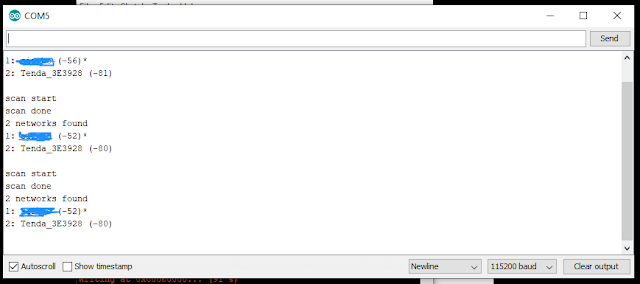

# Setup ESP32/NodeMCU di Arduino IDE

Jika Anda menggunakan perangkat ESP32 atau NodeMCU, Anda bisa menggunakan Arduino IDE untuk upload program. Ikuti langkah-langkah berikuti supaya Arduino IDE bisa mengenali ESP32/NodeMCU.

1. Buka Arduino IDE, kemudian klik Menu `File > Preferences`
   
   

   Pada kolom _Additional, tambahkan link berikut:
   ```
   https://dl.espressif.com/dl/package_esp32_index.json
   ```

2. Klik menu `Tools > Board: > Boards Manager ...`

   

3. Pada kolom pencarian tulis ESP32 kemudian install dan tunggu sampai selesai

   

4. Install telah selesai. Kemudian kita test.
   
   Klik menu `Tools > Board: > ESP32 DEV Module`. Jika Anda menggunakan NodeMCU, Anda bisa pilih `NodeMCU 1.0 (ESP-12E Module)` (atau _board_ lain sesuai dengan microcontroller yang Anda kerjakan)

   

   

5. Pilih socket COM:

   

**Beberapa permasalahan yang mungkin muncul**
- Untuk beberapa kasus, kadang perangkat ESP32 tidak bisa dikenali oleh Windows. Hal ini dapat dilihat pada _Device Manager_ ESP32 sebagai perangkat yang drivernya belum dikenal. Ikuti langkah berikut:
  1. [Download driver](https://www.silabs.com/documents/public/software/CP210x_Universal_Windows_Driver.zip) 
  2. Extract file
  3. Pada file _silabser.inf_, klik kanan kemudian pilih _Install_.
  4. Sesudah install, coba cabut pasang ESP32.
  5. Di Arduino IDE, klik _Select Board_ untuk mengecek apakah perangkat sudah bisa dikenali.
- Jika beberapa alternatif lain yang bisa dicoba jika perangkat belum bisa dikenali Windows:
  1. Coba _Uninstall_ device driver _CP2102_ di _Device Manager_ kemudian cabut pasang perangkat.
  2. Coba install ulang _ESP32_ pada _Board Manager_ Arduino IDE

## Testing

### Test perangkat Wifi

1. Buka example dengan klik menu `File > Example > WiFi > WiFiScan`

   

2. Setelah tampil, kemudian kita klik tombol upload (arah kanan). Tunggu hingga selesai compilenya. Jika sudah muncul tulisan "Conecting ... " pada keterangan dibawah, tekan dan tahan tombol "boot" pada hardware ESP32 yang berada pada sebelah kiri port usb.

   

3. Hingga ada tulisan "Leaving..." maka tombol boot boleh dilepas.

   

   Setelah itu maka akan ada pemberitahuan "Done Uploading"


4. Selesai Upload, kita buka Serial monitor yang ada disebelah kanan atas. Maka akan muncul tulisan seperti berikut:

   

**Sumber:**
- https://www.robotikindonesia.com/2020/01/cara-menggunakan-esp32-di-arduino-ide.html
- https://www.instructables.com/Steps-to-Setup-Arduino-IDE-for-NODEMCU-ESP8266-WiF/